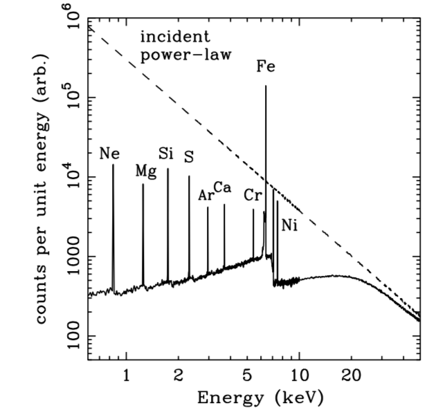
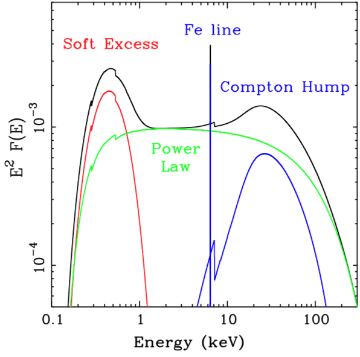
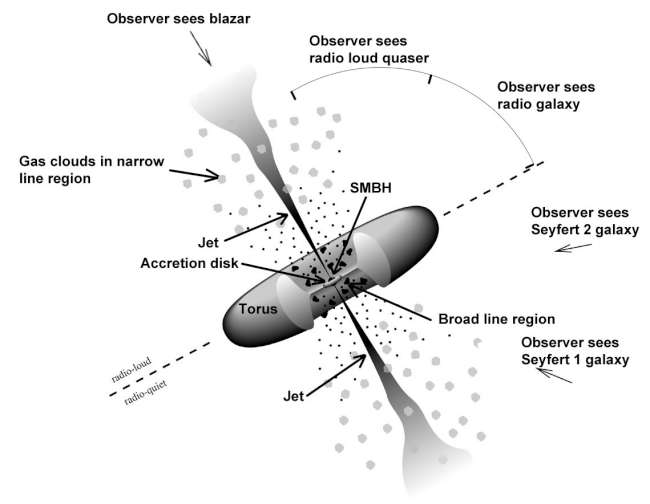

```{r setup, include=FALSE}
options(htmltools.dir.version = FALSE)
knitr::opts_knit$set(root.dir = "/Users/uskov/RProjects/Papers/17-sources/KMU-presentation/")
# xaringanExtra::use_fit_screen()

```


# Активные ядра галактик (АЯГ)

.pull-left[


Fig.caption
]

.pull-right[


.footnote[
[source](http://www.asdpaspdasd.com)
]
]

???

presentaion comment

---

# Активные ядра галактик (АЯГ)


```{r, echo=FALSE, out.width="50%", fig.cap="Fig. caption", fig.align='center'}

```

---

# 


---

# Цель работы

- Аппроксимация рентгеновских спектров активных ядер галактик (АЯГ)


