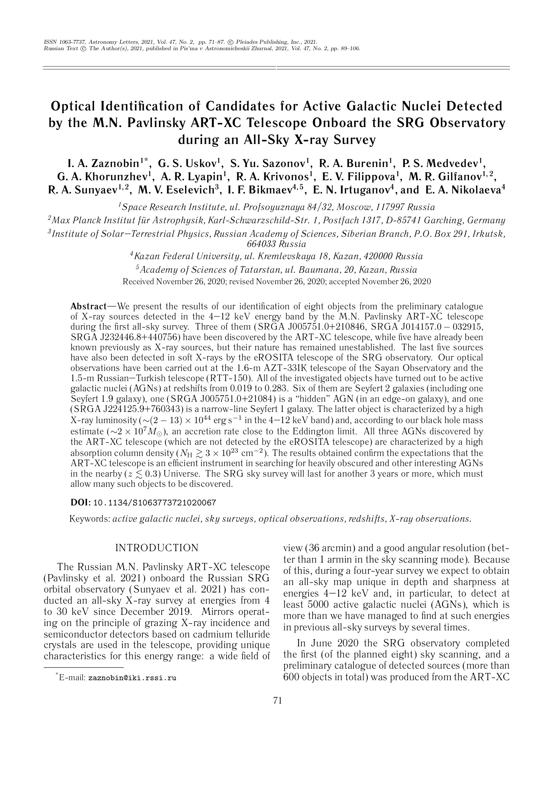
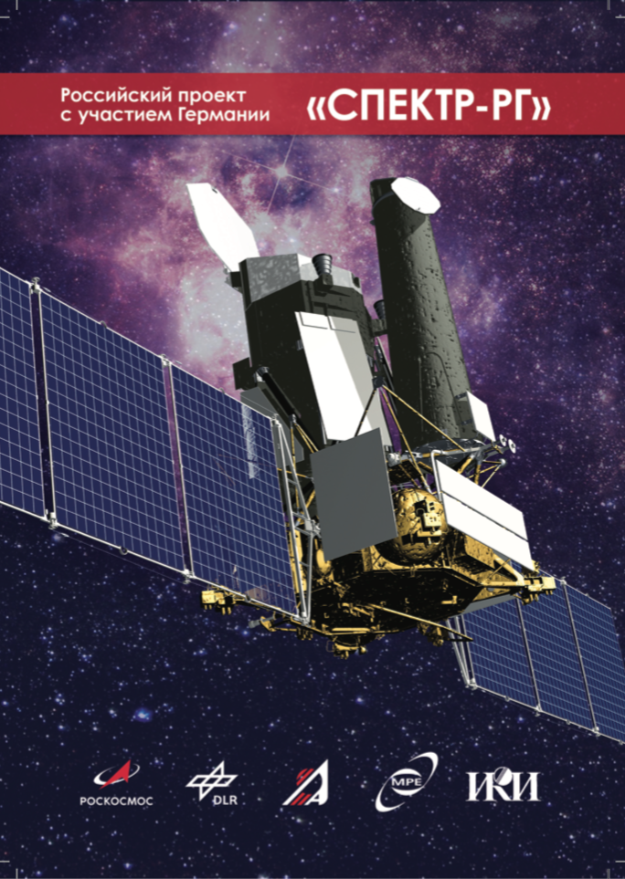
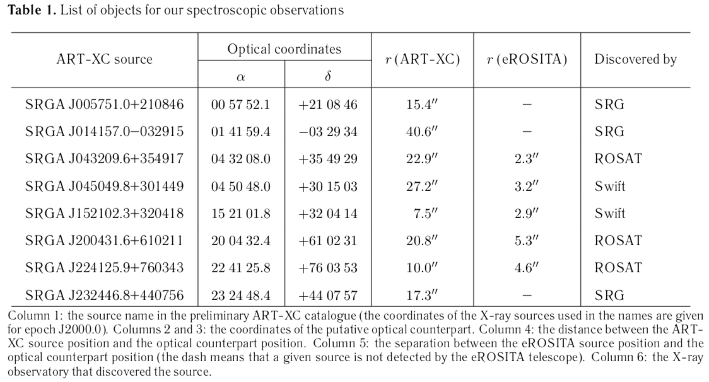
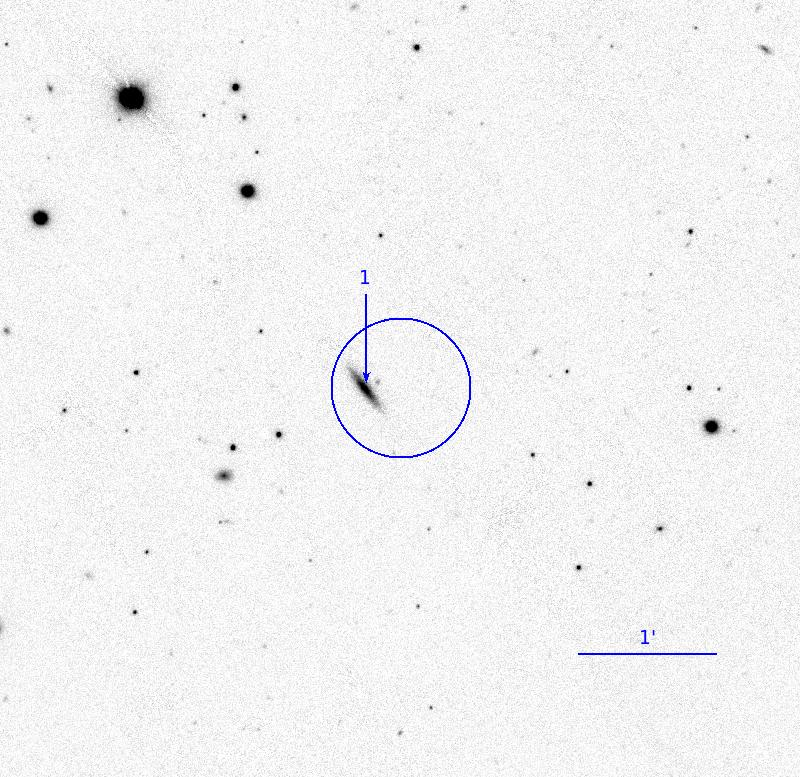
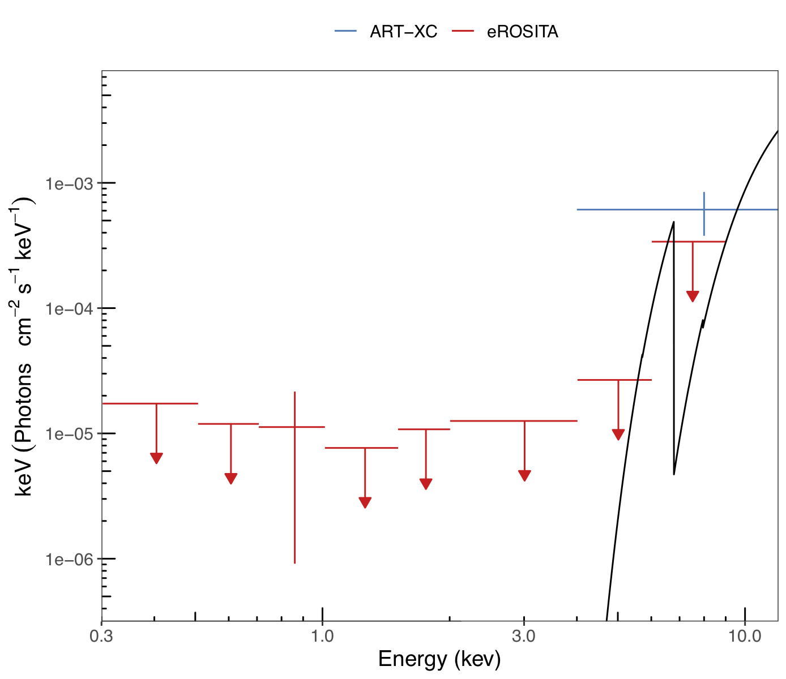
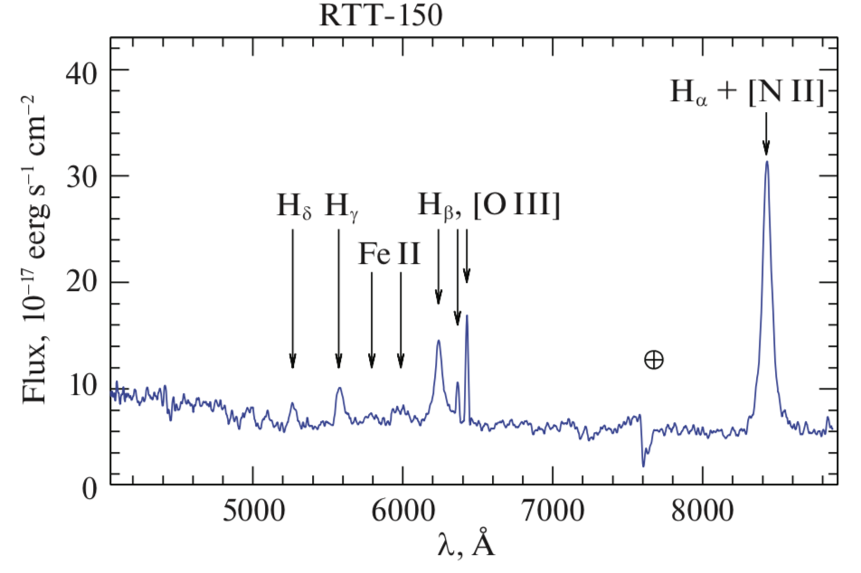
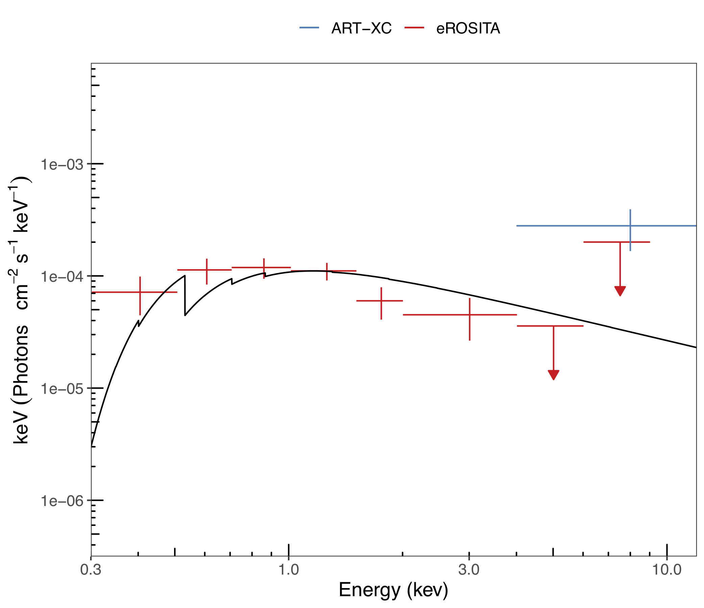
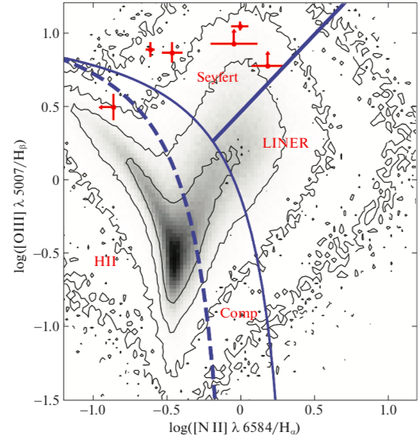
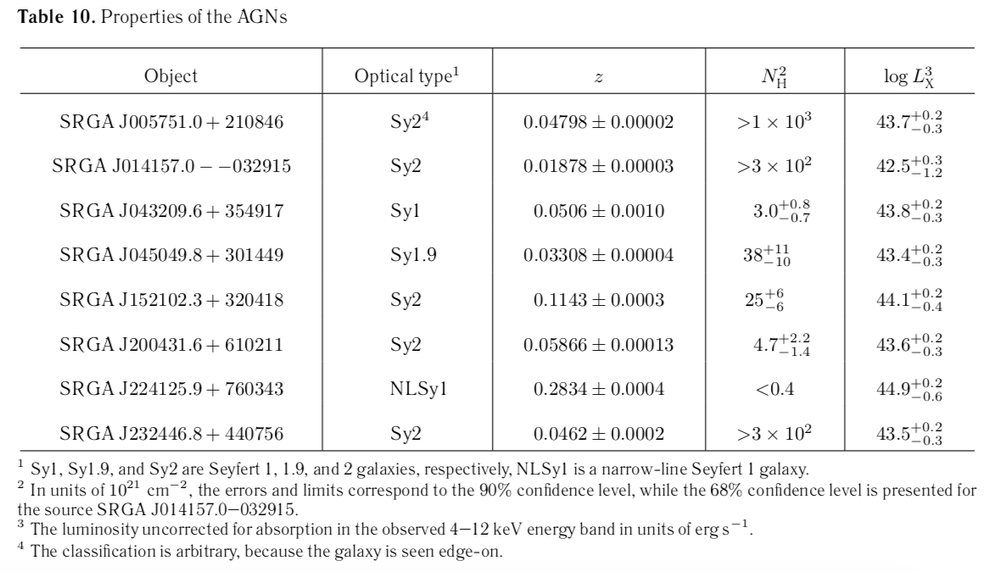

```{r setup, include=FALSE}
options(htmltools.dir.version = FALSE)

# xaringanExtra::use_fit_screen()

```

# История

.pull-left[

* Развитие радиоастрономии в 60-х

* Обнаружение квазаров (QSO, "quasi-stellar object" ):
  
  * Протяженные в радио и компактные в оптическом диапазоне

  * L > $L_{MW}$ , R ~ Солнечная система
  
  * pp-реакций недостаточно -> аккреция на СМЧД $(10^6-10^8)M_\odot$
  

* Открытие излучения квазаров в рентгеновском диапазоне


]


---

class: left

# История


.pull-left[

* В 1963г. Мартин Шмидт на оптическом спектре заметил закономерность $\lambda=1.16~\lambda_0$


<p class='caption'> Источник: isdc.unige.ch/3c273 </p>


]


.pull-right[

Серия Бальмера

```{r echo=FALSE}
balmer <- dplyr::tibble(
       `Обозначение` = c("n", "Длина волны, A"),
                `Hα` = c(3, 6563),
                `Hβ` = c(4, 4861),
                `Hγ` = c(5, 4341),
                `Hδ` = c(6, 4102),
)

knitr::kable(balmer, format = 'html')
```
]

--

* z=0.16 (650 МПк) и $m_V\approx13^m$ -> не звезда

--

* Аналогично для 3C48, z=0.37

---

# Структура АЯГ

* В центре ЧД $10^6M_\odot < M < 10^{10} M_\odot$

--

* Аккреционный диск - главный источник энергии, T < $10^6$ K


---

class: left

# Структура АЯГ

.pull-left[

**Рентгеновская корона**

* T ~ $10^7$ К

* Тепловой спектр 

 
  * Степенной спектр с завалом на высоких энергиях $F_X\sim E^{-\Gamma}exp(-E/E_c)$, $E_c \approx 40-300$ keV
  

  * Комптоновский горб ~ 30 кэВ
  

  * Флуоресцентная линия Fe $K\alpha$ 6.4 кэВ.
  
    

]

.pull-right[

```{r echo=F, out.height="400", fig.show='hold', fig.cap='(Fabian et.al. 2005)'}
knitr::include_graphics(c('images/agn-xray-spectrum.png'))
```

]

---

background-image: url(images/agn-unified-model.jpg)
background-position: right

# Структура АЯГ


* Broad Line Region (BLR)

  * Излучает в линиях

  * R < 1 Пк от ЧД (по картированию). 
  
  * FWHM ~ 3000 км/с >> 10 км/с (T~1e4 K)
  
--


* Narrow Line Region (NLR)

  * Излучает в линиях
  
  * R ~ 100 Пк от ЧД. 
  
  * FWHM 300-500км/с, но все равно шире теплового уширения.

--

* Тор

  * R ~ 1 Пк от ЧД, светит в ИК

--

* У 10% имеются джеты


---




---


# Обсерватория СРГ
.pull-left[


```{r, echo = FALSE, out.width="400", fig.show='hold', fig.align = 'center',fig.cap="Карта всего неба телескопа (сверху) eROSTIA 0.3-2 кэВ, (снизу) ART-XC 4-12 кэВ."}

knitr::include_graphics(c('images/eros-map.png','images/art-map.jpg'))

```


]


.pull-right[


```{r, echo = FALSE, out.width="300", fig.align='centr', fig.show='hold', fig.cap=' '}

```

]


---

# Выборка и результаты

* В июне 2020г завершился первое сканирование всего неба

--

* Был составлен каталог зарегистрированных источников по данным ART-XC

--

* Корреляция с другими каталогами

* Корреляция с предварительным каталогом eROSITA 0 < |l| < 180

--

* Проводились спектроскопические наблюдения на российских оптических телескопах для их отождествления

--

* Были определены: 

  * тип АЯГ 
  
  * внутреннее поглощение

---

# Источники

```{r, echo = FALSE, out.width="900", fig.align='centr', fig.show='hold'}

```

---

# SRGA J005751.0+210846 

**наблюдается с ребра**

.pull-left[
```{r, echo=FALSE, out.width="400"}

```

]

.pull-right[

```{r, echo=FALSE, out.width="400"}

```
]

---

# SRGA J224125.9+760343, NLSy1


.pull-left[
```{r, echo=FALSE, out.width="400", fig.cap='Оптический спектр, снятый на РТТ-150'}

```

]

.pull-right[

```{r, echo=FALSE, out.width="400", fig.cap='Рентгеновский спектр. Здесь наклон Γ = 2.4. $N_H < 4\\times10^{20}cm^{-2}$'}

```
]

---

# Классификация

.left-column[

Расположение исследуемых АЯГ (красные точки и пределы) на BPT-диаграмме (Балдвин и др., 1981),полученной по данным Слоановского обзора (выпуск 7, Сообщество СДСС 2009). Разграничительные линии между разными классами галактик взяты из работ: Кауффманн и др. (2003) – штриховая линия, Кеули и др.(2001) – тонкая линия, Жавински и др. (2007) – толстая линия. Показаны только 6 объектов, для которых намудалось определить параметры требуемых линий. Диаграмма построена с помощью сайта http://wwwmpa.mpa-garching.mpg.de/SDSS/DR7/Data/gal_line_dr7_v5_2.fit.gz
]

.right-column[


```{r, echo=FALSE, out.width="400", fig.align='right'}

```

]


---

# Результаты

```{r, echo=FALSE, out.width="900"}

```

---

# Заключение

* Нам удалось отождествить 8 новых активных ядер галактик среди рентгеновских источников, зарегистрированных в ходе первого обзора неба с помощью телескопа ART-XC обсерватории СРГ. 

* Были измерены красные смещения этих объектов, 

* а также изучены их оптические 

* и рентгеновские свойства.


