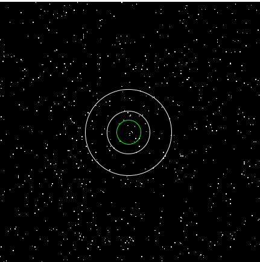

## Оценка предельной чувствительности eRosita

Для оценки поглощения в АЯГ нам необходимо оценить предел чувствительности телескопа eRosita за время экспозиции. Для этого мы выберем кружок, в котором находится наш источник (на картинке ниже он зеленого цвета) и оценим количество фоновых отсчетов в нем. Чтобы оценить количество фоновых отсчетов в зеленом кружке нам необходимо узнать количество фоновых отсчетов за пределами кружка источника. В данном случае мы рассмотрим фон в белом кольце bg_region.



*1 pix = 4". Координата источника RA=23:24:48.4, DEC = + 44^o^07'57".0*


Параметры bg_region:  

* sum: 52 cnts  
* area: 94144 arcsec^2^  
* radius: inner - 100", outer - 200"  

Параметры src_region:  

* sum: 9  
* area: 9856 arcsec^2^  
* radius: 56" (мы взяли кружок 2*hew; обзорное угловое разрешение ~28")  


Таким образом ожидается **5.44** фоновых отсчетов в кружке src_region.


Далее нам необходимо найти такое количество отсчетов N, при котором Пуассоновская вероятность $p(N > \lambda) < 0.01 (или \space0.05)$. 


<!-- -->

Мы получили отсчеты: **10** для 0.05 и **12** для 0.01. Это и будут пределы чувствительности телескопа eRosita. 


## Модель

Мы использовали модель MYTORUS: $$  phabs×(powerlaw * MYTZ + MYTS + MYTL)$$

* phabs -- поглощение при прохождении света в Галактике.

* powerlaw -- исходный спектр СМЧД.

* MYTZ -- определяет поглощение излучения рентгеновского источника в торе. 

* MYTS -- описывает спектр излучения СМЧД, вышедшего наружу после отражения в торе.

* MYTL -- описывает флуоресцентные линии железа и никеля, возникающие в результате фотопоглощения в газе тора рентгеновского излучения СМЧД.

Мы предположили, что спектр имеет параметры $\Gamma = 1.8$, $\Theta = 45^0$ :

```
phabs<1>(zpowerlw<2>*etable{mytorus_Ezero_v00.fits}<3> + atable{mytorus_scatteredH500_v00.fits}<4> + atable{mytl_V000010nEp000H500_v00.fits}<5>)
Model Model Component  Parameter  Unit     Value
 par  comp
   1    1   phabs      nH         10^22    0.136300     +/-  0.0          
   2    2   zpowerlw   PhoIndex            1.80000      +/-  0.0          
   3    2   zpowerlw   Redshift            4.62500E-02  +/-  0.0          
   4    2   zpowerlw   norm                1.00000      +/-  0.0          
   5    3   MYtorusZ   NH         10^24    10.0000      +/-  0.0          
   6    3   MYtorusZ   IncAng     Degrees  45.0000      +/-  0.0          
   7    3   MYtorusZ   z                   4.62500E-02  = p3
   8    4   MYtorusS   NH         10^24    10.0000      = p5
   9    4   MYtorusS   IncAng     Degrees  45.0000      = p6
  10    4   MYtorusS   PhoIndx             1.80000      = p2
  11    4   MYtorusS   z                   4.62500E-02  = p3
  12    4   MYtorusS   norm                1.00000      = p4
  13    5   MYTorusL   NH         10^24    10.0000      = p5
  14    5   MYTorusL   IncAng     Degrees  45.0000      = p6
  15    5   MYTorusL   PhoIndx             1.80000      = p2
  16    5   MYTorusL   z                   4.62500E-02  = p3
  17    5   MYTorusL   norm                1.00000      = p4
```


