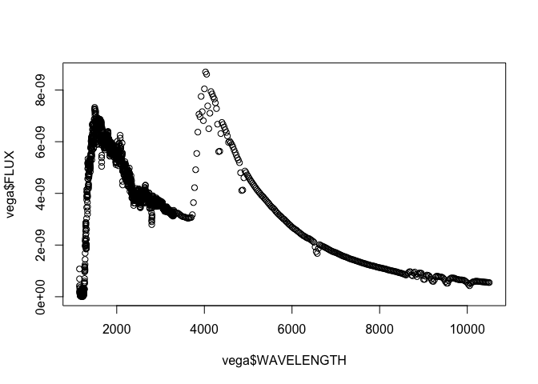
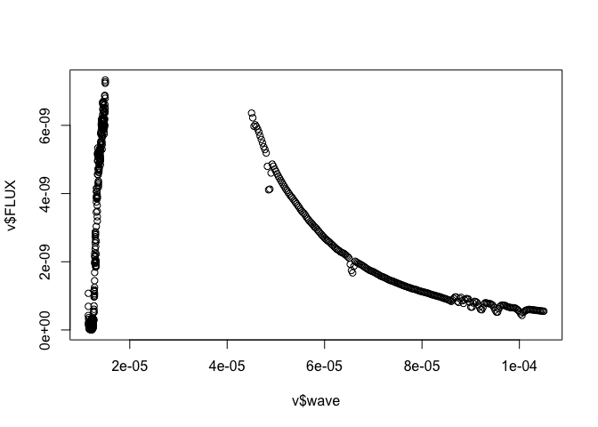
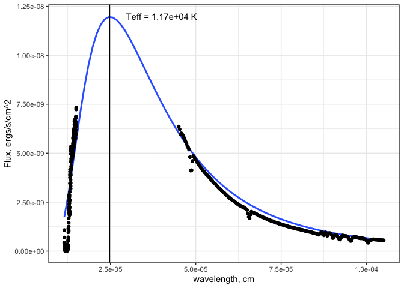

Пример аппроксимации спектра Веги blackbody с помощью функции `nls`. 

# Подготовка данных


```r
vega <- Rfits::Rfits_read_table('/Users/uskov/cdbs/grp/hst/cdbs/calspec/alpha_lyr_004.fits')
knitr::kable(head(vega, 5), digits = 19)
```


| WAVELENGTH|         FLUX|    STATERROR|     SYSERROR| FWHM|
|----------:|------------:|------------:|------------:|----:|
|     1148.6| 4.231930e-10| 1.500923e-10| 1.269579e-11|    6|
|     1149.8| 1.074815e-09| 1.224334e-10| 3.224444e-11|    6|
|     1151.0| 6.924784e-10| 1.953435e-10| 2.077435e-11|    6|
|     1152.2| 1.527626e-10| 1.435415e-10| 4.582877e-12|    6|
|     1153.4| 2.096845e-10| 8.304814e-11| 6.290536e-12|    6|

```r
plot(vega$WAVELENGTH, vega$FLUX)
```

<!-- -->

По графику видно, что на длинах волн 1500--4500 спектр не будет описываться степенной моделью, поэтому исключим данные точки. Сразу создадим новый столбец длин волн в сантиметрах.


```r
v <- vega %>% 
  dplyr::mutate(wave = WAVELENGTH * 1e-8) %>% 
  dplyr::filter(WAVELENGTH > 4500 | WAVELENGTH < 1500)
plot(v$wave, v$FLUX)
```

<!-- -->

# Аппроксимация

Формула [BlackBody](http://burro.cwru.edu/Academics/Astr221/Light/blackbody.html)


```r
bb <- function(lambda, temperature){
  h <- 6.626e-27
  k <- 1.38e-16
  c <- 3e10
  (2*h*c^2 / lambda^5) / (exp(h*c/lambda/k/temperature) - 1)
}

y <- v$FLUX
x <- v$wave
fit <- nls(y ~ a * bb(x, t), start = list(a = 1, t = 1e5))
summary(fit)
```

```
## 
## Formula: y ~ a * bb(x, t)
## 
## Parameters:
##    Estimate Std. Error t value Pr(>|t|)    
## a 1.359e-24  5.159e-26   26.35   <2e-16 ***
## t 1.166e+04  5.754e+01  202.70   <2e-16 ***
## ---
## Signif. codes:  0 '***' 0.001 '**' 0.01 '*' 0.05 '.' 0.1 ' ' 1
## 
## Residual standard error: 1.1e-09 on 514 degrees of freedom
## 
## Number of iterations to convergence: 17 
## Achieved convergence tolerance: 2.248e-06
```


Температура T = $1.1663123\times 10^{4}$, а коэффициент нормировки norm = $1.3592148\times 10^{-24}$

Аналогично можно построить график с помощью `ggplot2` и там же аппроксимировать

```r
max_flux_wave <- 2.89e-3/fit$m$getPars()[2] * 100
Teff <- round(fit$m$getPars()[2], 0)
v %>% 
  ggplot(aes(wave, FLUX)) +
  stat_smooth(method = 'nls', se = F, method.args = list(start = list(a=1, t = 1e5)),
              formula = y ~ a * bb(x, t)) +
  geom_point() +
  geom_vline(aes(xintercept = max_flux_wave)) +
  annotate(geom = "text", 
           label = glue::glue("Teff = {Teff} K"),
           x = 4e-5, 
           y = 1.2e-8) +
  theme_bw() +
  xlab('wavelength, cm') + 
  ylab('Flux, ergs/s/cm^2')
```

<!-- -->


